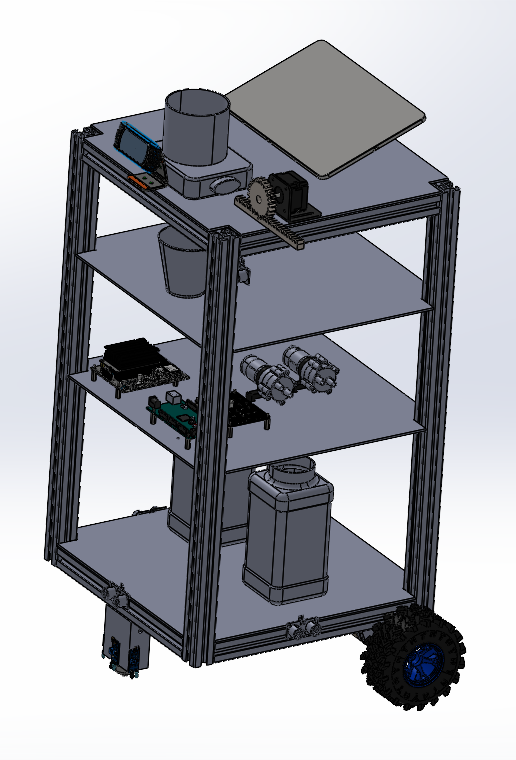
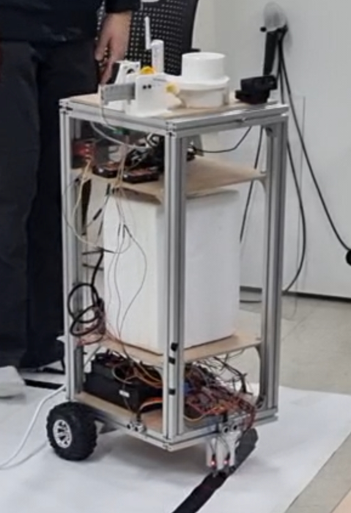
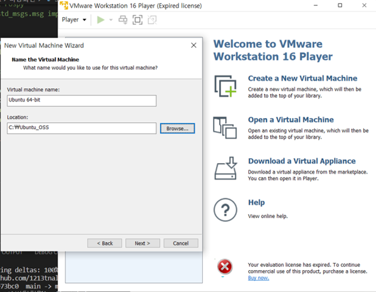
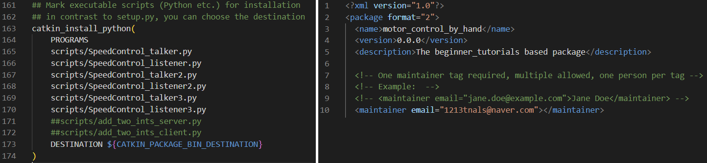
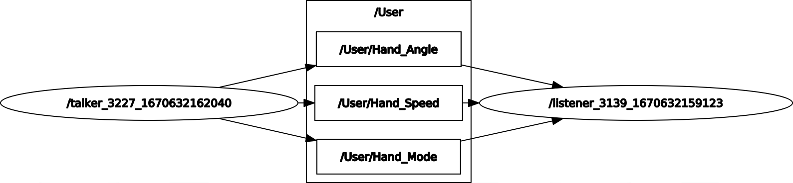
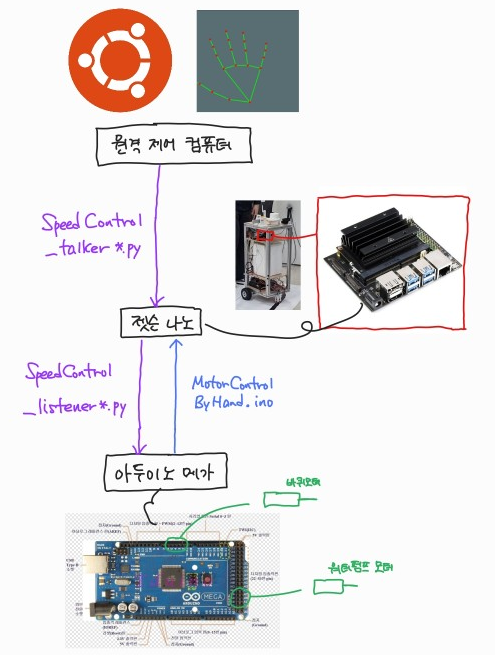
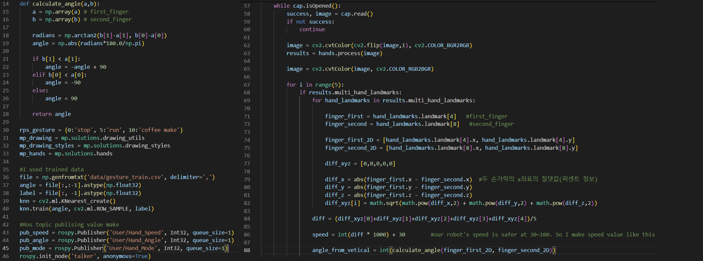
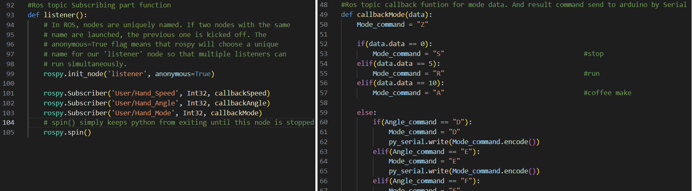
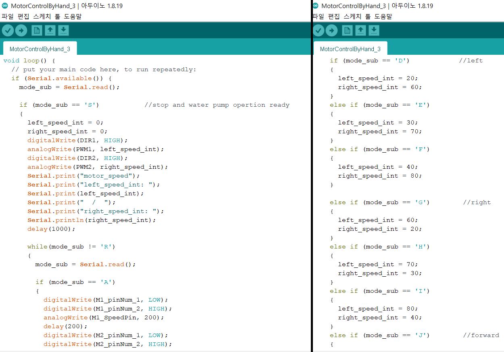

   
# MobileCoffeeMachineControl-by-Handcontrolling  
   
   
   
   
자동화시스템 수업 최종발표를 위해 이동형 커피 자판기 로봇(모바일 로봇)을 제작하였습니다.   
   
   
위의 이미지와 같이 생긴 모바일 로봇으로 라인트래킹, PID제어를 통한 장애물 회피를 하여 이용자에게 찾아가면 이용자는 로봇의 상부에 위치한 화면에 표시되는 GUI를 통해서 원하는 커피를 주문, 받을 수 있도록 제작을 하였습니다.   
자동화시스템은 로봇의 자동화 작업이 주목적이지만, 이 로봇을 오픈소스를 통한 영상처리를 이용하여 사람과의 상호작용을 통한 제어를 한다면 재미있는 작업을 할 수 있을 것이라 생각이 들어 로봇만 가져와 내부 제어 코드를 바꾸어 로봇을 제어하는 코드를 작성하였습니다.(하드웨어는 자동화시스템 로봇의 것을 가져왔지만 제어를 위한 통신 및 제어 코드는 새로 작성하였습니다.)   
   
자동화시스템에 사용하는 로봇에 관련된 리포지토리는 [이 링크](https://github.com/1213tnals/CoffeeRobot)를 통해 확인하실 수 있습니다.   
   
   
이 리포지토리에서는 손의 다양한 모션을 바탕으로 원격으로 모바일 로봇에 신호를 보내어 속도를 제어, 방향을 제어, 커피 제조 작업할 수 있습니다.   
영상에서 나온 것처럼 로봇을 원격으로 제어하기 위해서는 컴퓨터에 로봇을 직접적으로 연결하지 말고 처리를 하는 다른 컴퓨터나 jetson Nano와 같은 보드를 사용하셔야 합니다. 저는 원격 자동화로봇을 위해서 로봇이 ***jetson Nano***와 연결이 되어있기 때문에 컴퓨터로 mediapipe의 결과 데이터를 ROS를 통해서 젯슨으로 송신하는 환경에서 진행하였습니다.)   
   
   
   
이 코드를 사용하기 위해서 필요한 사전 작업들   
- 우분투 환경에서 작동할 수 있는 ros 패키지 생성을 파일이 있으므로 **ROS**가 설치된 우분투가 필요(VMware, VirtualBox 등)   
- python3에 **opencv, mediapipe, pyserial, git** 설치   
- **arduino** 설치   
   
   
   

## 사용방법
### 1. 우분투 환경구성
   
   
이 리포지토리의 코드들을 사용하기 위해서 우분투 환경을 구성해야합니다. 우분투에 파이썬을 설치를 하고 파이썬에 opencv, mediapipe, pyserial(손 인식 데이터 송신측과 수신측은 ROS-TCP를 통해서 원격으로 이루어지며, 수신측에 물린 아두이노는 Serial통신을 통해서 데이터의 송수신이 일어납니다), git을 설치해주시기 바랍니다. catkin_ws 폴더를 생성, catkin_ws 폴더 내에 src 폴더를 생성하고 이곳으로 이동(명령어: ***cd***)하시기 바랍니다. 이후 git clone으로 이 리포지토리를 다운받으시기 바랍니다.   
   
   

### 2. ROS 설치   
   
    
윈도우 환경을 이용하시는 분들은 ROS가 설치될 우분투 os를 사용하기 위해서 VMware, VirtualBox 등을 사용해주시기 바랍니다.   
   
   
[ROS(Robot Operating System)](https://www.ros.org/)은 로봇을 작동하기 편한 환경을 제공하는 툴입니다. 우분투 버전별로 사용가능한 ROS 버전이 다르므로 (noetic-ubuntu20.04, melodic-ubuntu18.04,...) 위의 하이퍼링크를 통해서 사용법을 자세히 확인한 후 ROS가 설치된 환경에서 작동시켜주시기 바랍니다. 작동만 해보실 분들은 위의 링크에서 튜토리얼의 첫번째 과정인 'ROS 설치"만 진행하셔도 됩니다.
   
   

### 3. ROS 환경구성   
   
ROS는 토픽을 통해서 데이터를 송수신을 합니다. 데이터를 송신하는 측(이 리포지토리에서 motor_control_by_hand/talker*.py), 데이터를 수신하는 측(이 리포지토리에서 motor_control_by_hand/listener*.py)이 서로 송수신하기 위해서는 같은 IP를 공유하고 있어야 합니다. 같은 IP 내에 접속해있는 데이터 송신측과 수신측은 하나의 roscore가 실행되어있는 환경에서 데이터의 송수신이 가능합니다. 따라서 .bashrc에 접근을 하여 roscore가 실행되어있는 곳의 ip주소를 마스터로 지정해주시기 바랍니다.(명령어: ***sudo apt install net-tools*** 를 통해서 ifconfig를 사용할 수 있습니다.)   
바로 빌드하여 사용할 수 있도록 패키지를 위한 **CMakeLists.txt, pakage.xml를 만들어 두었습니다.** 이 패키지를 빌드하기 위해서 명령어: ***catkin_make***를 사용하시거나 catkin tool을 추가적으로 설치하여 ***catkin build***로 패키지를 빌드해주시기 바랍니다. 빌드가 되었다면 터미널에서 motor_control_by_hand 라는 패키지가 생성되었다고 알림이 뜨게 됩니다.   
   
   

### 4. 아두이노   
수신측에 아두이노를 물려주시기 바랍니다. MotorControlByHand* 파일을 아두이노로 업로드를 진행해주시기 바랍니다. 아두이노를 연결할 때 포트의 정보를 확인하시고 포트가 "dev/ttyUSB0"인지 확인해주시기 바랍니다. 혹시 이와 다르다면 motor_control_by_hand/talker*.py, motor_control_by_hand/listener*.py 코드에서 포트의 번호를 바꾸어주시기 바랍니다.
   

   
### 5. ROS 패키지 사용   
터미널을 열어주셔서 catkin_ws/src/MobileCoffeeMachineControl-by-Handcontrolling 으로 이동해주시기 바랍니다.(명령어: ***catkin_ws/src/MobileCoffeeMachineControl-by-Handcontrolling***) 이후 송신측과 수신측은 아래의 설명에 따라 코드 실행을 진행해주시기 바랍니다.
   
   
   
   
   
   

#### 1) 송신측(영상처리부)   
명령어: ***rosrun motor_control_by_hand SpeedControl_talker*.py***   
   
#### 2) 수신측(로봇제어부)   
명령어: ***rosrun motor_control_by_hand SpeedControl_listener*.py***   
   
   
로봇은 속도 제어에서 빠름/중간/느림, 방향 제어에서 좌/직진/우, 모드 제어에서 멈춤,음료 제작/이동 으로 여러 모드로 구성되어있습니다.   
엄지와 검지 사이 거리를 통해서 속도를 제어, 엄지와 검지가 만드는 임의의 직선이 1 방향과 이루는 각도를 통해서 방향제어, 손의 전제척인 모습(접었을 경우-S 정지, 폈을 경우-R 이동, 손가락으로-A ok를 만든다면 음료를 제작)으로 제어가 가능합니다.   
   
   
   

### 간단한 코드 설명   
listener1과 talker1, listener2과 talker2, listener3과 talker3 서로 연결되는 통신코드들이며 각각 속도만 제어, 속도와 각도 제어, 속도와 각도와 모드 제어가 가능한 코드들입니다. listener3과 talker3에 있는 코드가 1,2에도 들어있으므로 3에 대한 설명만 작성합니다. 또한 cpp 기반의 아두이노 코드도 이와 동일합니다. 코드 내에도 한글과 영어가 섞인 주석들이 달려있습니다.(작업한 우분투 환경에 한글이 설치되어있지 않아 초기 윈도우 환경 작업에서 한글 주석, 이후 작업에서 영어 주석만 달리게 되었습니다.)   
   
1. 통신 및 영상처리코드(listener3, talker3)   
      
    1.1 **talker3**   
       
    pub_speed = rospy.Publisher('User/Hand_Speed', Int32, queue_size=1)에서 첫 파라미터는 토픽의 이름, 두 번째 파라미터는 자료형을 의미합니다. 수신측에서도 이에 맞는 토픽 이름, 자료형이어야지 수신받을 수 있습니다.   
    landmark[4], [8]은 엄지와 검지에 해당하는 값입니다. 이 두 값을 통해서 로봇을 제어할 Speed와 Angle을 구합니다. 
    Speed의 경우 점과 점 사이거리를 통해서, Angle의 경우 두 점 사이의 임의의 직선과 전방으로 뻗는 직선이 이루는 각을 통해서 구합니다.  
    v 는 각 landmark들의 연관관계를 통해서 현재 손의 자세를 인식할 수 있게 해줍니다. 이 값으로 학습된 데이터를 기반으로 현재 손 모양을 인식하여 모드(정지, 이동, 음료 제작)를 결정합니다.   
   
      
    1.2 **listener3**   
       
    rospy.Subscriber('User/Hand_Speed', Int32, callbackSpeed)에서 처음과 두번째 파라미터는 송신부와 일치해야합니다. 세번째 파라미터는 콜백함수로 토픽이 들어왔을 때 작동할 함수를 지정합니다.   
    callbackSpeed, callbackAngle, callbackMode는 각각 콜백함수이며 talker3로부터 온 데이터의 내용을 조건문에 따라 아두이노로 Serial 통신을 통해서 보낼 데이터를 선택해줍니다.   
   
   
2. 모터제어부(**MotorControlByHand_3**)   
      
    lister3을 통해서 시리얼로 받은 값을 바탕으로 처리를 진행합니다.   
    정지(S) 중일 때는 음료 제작(A)이나 이동(R)의 값을 기다립니다.   
    이동(R) 중일 때는 이동에 관한 값(D~L)을 기다립니다.   
   

   

##### 고려한 사항 및 사용에 유용한 정보   
- 로봇의 속도가 갑작스럽게 바뀌는 것을 방지를 하기 위해서 데이터를 5번 받고 평균을 내어 그 값을 기준으로 처리가 진행되도록 함   
- 토픽의 송수신이 일어나는 속도에 비해서 아두이노가 데이터를 송수신하는 속도가 현저히 낮아 데이터를 바로 처리하지 않고 일정 범위 내에 있는 동안에는 값이 갑작스럽게 바뀌지 않도록 함, 파이썬에서 아두이노로 보내지는 데이터는 최대한 단순화된 데이터를 보내도록 함, 토픽이 송수신이 일어나는 과정에서 송신측에서가 토픽을 보내는 중간에 delay가 있도록 함.(time.sleep)
- VMware를 사용하는 경우 상단 오른쪽에 있는 카메라를 반드시 킬 것
- 아두이노가 잡히지 않는다면,   
명령어: ***sudo usermod -a -G dialout 사용자이름(sumin)*** 으로 권한 설정,   
명령어: ***ls –l /dev/*** 로 아두이노가 연결이 됬는지 확인   
명령어: ***sudo chmod 666 /dev/ttyUSB0***
   
   
   
   

## 작업물 결과   
### 사용 이미지   
사용하는 과정 이미지들 첨부예정   
   
### 1. SpeedControl_listener1.py, SpeedControl_talker1.py   
속도 제어만 들어있는 패키지   
gif 이미지 첨부예정   
   
### 2. SpeedControl_listener2.py, SpeedControl_talker2.py   
속도, 방향 제어가 들어있는 패키지   
gif 이미지 첨부예정   
   
### 3. SpeedControl_listener3.py, SpeedControl_talker3.py   
속도, 방향, 음료 제작/모드 전환 제어가 들어있는 패키지   
gif 이미지 첨부예정   

### 전체 작동과정 영상   
유튜브 링크 첨부예정   